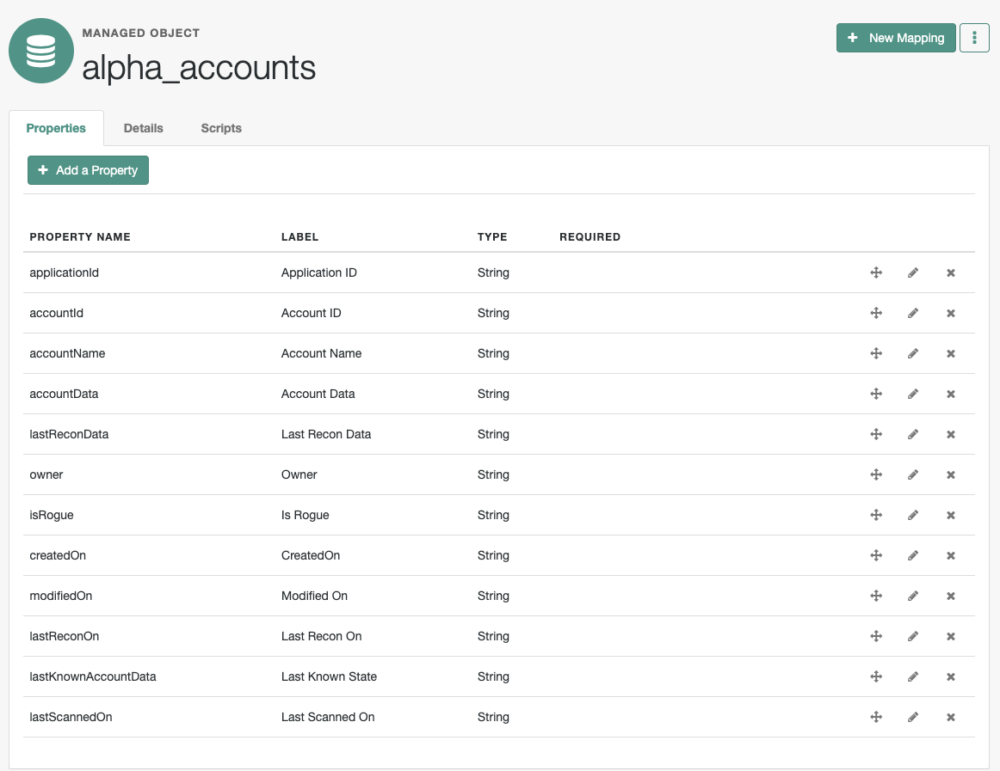
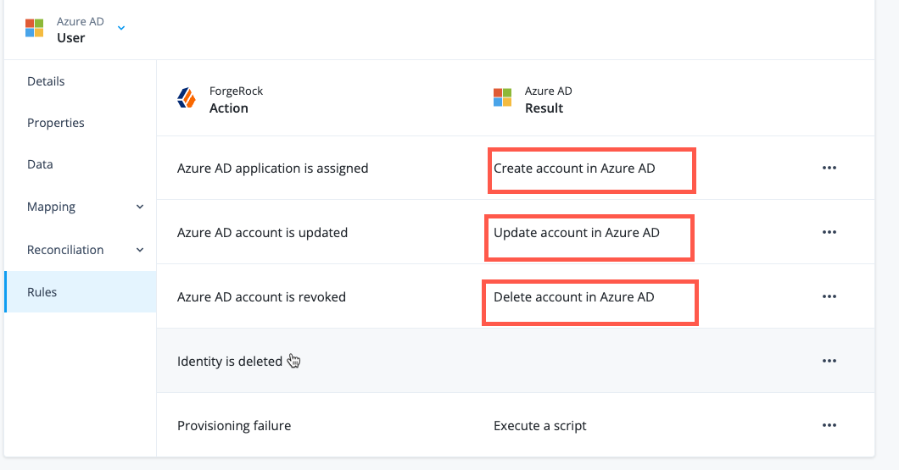
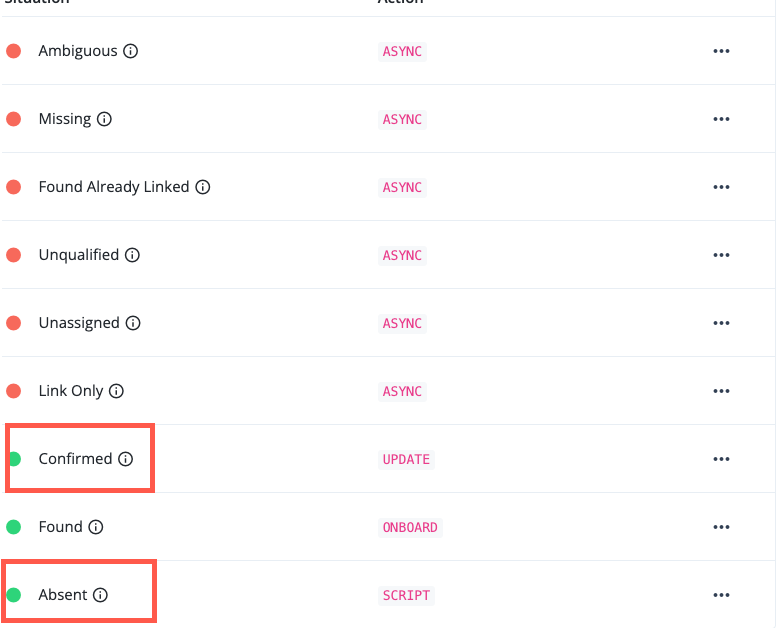

# Native Change Detection in IDM

## Summary

This document describes a customization developed to address actionable rogue account/ rogue change detection for CVR Energy

## Problem Statement

-   CVR Energy wants to detect un-sanctioned changes in user accounts in applications as part of target reconciliation (or inbound sync). The changes can be in one or more single or multi-valued attributes, which may or may not be entitlements.

-   Once the changes are detected, they want the ability to take action which includes but is not limited to sending an email, creating an incident or other actions.

-   They want the ability to accept the changes or reject the changes and overwrite the data in the target application based on their business criteria

## Related RFE

CVR Energy uses Active Directory (on-premises, multiple domains), Azure AD Connect and Exchange (SaaS and on-premises). There needs to be a way to provision mailboxes taking into account the delay in AD - Entra ID sync. They have a job that runs hourly for mailbox provisioning. They need to know when the AD account was created so that they can trigger Exchange mailbox provisioning

## Customer expectations

-   There exists a way to get a list of accounts, orphan or otherwise, with account data

-   There exists a way to detect changes in account attributes, regardless of whether they are entitlements or not

-   There exists a way to take action on accounts that have unsanctioned changes

## Solution description

The solution leverages the following AIC capabilities

-   Ability to create custom managed objects

-   Ability to add pre-, post-hooks on implicit sync (provisioning) and inbound sync (reconciliation)

-   Ability to run custom scheduled jobs where the job can execute custom business logic

We introduce a new managed object (MO), alpha_accounts, with the following structure

Each instance of this managed object represents an account in an application. The structure of the MO is generic allowing it to be used for any application

MO instances are created

1.  When an account is provisioned as part of admin/ request/ role-based provisioning

2.  When an account is discovered for the first time as part of inbound sync (target reconciliation)

MO instances are also created as part of handling edge use cases using. an upsert operation (check if account exists, if not create it, then work on it)

MO instances are updated

1.  When an account is updated as part of admin/ request/ role-based provisioning

2.  When account updates are brought in as part of target reconciliation

3.  

We make use of the following hooks for Provisioning (the screenshot is representative)

We make use of the following hooks for Reconciliation

**Gap:** We wanted to catch the account on first discovery in inbound sync (FOUND) but, currently, post-Action on FOUND has been disabled.

## Solution Details

-   The customer is expected to modify the scripts provided in the Appendix. They need to configure the above mentioned hooks **for every application** and provide the necessary information.

-   They need to run Day 0 onboarding (Day 0 recon) to onboard existing accounts. This results in existing accounts with account data being persisted in the account store

-   They need to run Day 0 onboarding again to allow us to link the owner with account (due to the FOUND limitation)

-   At this point, the account store has

    -   Accounts, with account data, linked to a managed user

    -   Accounts, with account data, not linked to a managed user

-   Next, the customer can carry out their provisioning and reconciliation in any sequence and any number of times

-   When they run subsequent reconciliation

    -   The solution will check if the account exists in the account store, if it doesn’t it will be added

    -   If the account exists, the current account data will be copied in an attribute lastKnownAccountData, and incoming data will be captured in recon data and account data.

    -   At this point, we know the last known good state and the data that was brought in as part of reconciliation

-   A job, RogueAccountScanner, is available which accepts

    -   Application ID

    -   Attributes where change to be detected. These can be any attribute in the account object type

    -   Action. Currently, this is left open-ended for the SI to implement as they wish

-   When the job is run, it iterates through all accounts for an application and for every account

    -   It compares the lastKnownAccountData with the Recon Data

        -   It iterates over every attribute that needs native change detection

        -   If it finds a delta, it records that

        -   It emits a record containing the delta for each attribute for each account

## Performance

The solution was tested for 2 applications, one SaaS and one with RCS, and 3,000 users. There was no observable performance impact. This is not a scientific observation since no JVM, IDM server level metrics were captured. We measured it using the computer clock.
